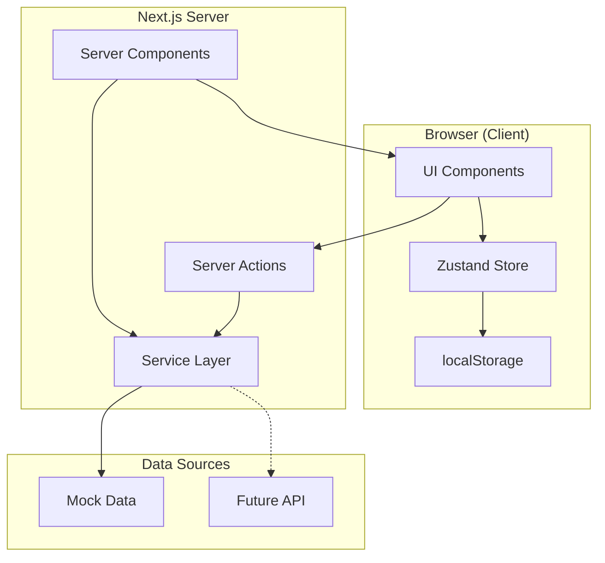

# Design Document: Modernização PDV Next.js 16

## Overview

Este documento descreve a arquitetura e design para modernização do sistema PDV, transformando-o de uma prova de conceito client-side para uma aplicação híbrida que aproveita Server Components, Server Actions e gerenciamento de estado otimizado com Zustand.

A modernização segue o princípio "Server-First": dados são carregados no servidor, componentes são Server Components por padrão, e apenas interatividade específica é delegada para Client Components menores.

## Architecture

### Diagrama de Arquitetura



### Fluxo de Dados

1. **Carregamento Inicial**: Server Component busca dados via Service Layer
2. **Renderização**: Server Component passa dados para Client Components como props
3. **Interatividade**: Client Components usam Zustand para estado local
4. **Mutações**: Client Components chamam Server Actions para persistir mudanças
5. **Persistência Local**: Zustand sincroniza carrinho com localStorage

## Components and Interfaces

### Estrutura de Pastas

```
src/
├── app/
│   └── page.tsx                    # Server Component (entry point)
├── features/
│   └── pdv/
│       ├── components/
│       │   ├── pdv-client.tsx      # Client Component principal
│       │   ├── cart/
│       │   │   ├── cart-section.tsx
│       │   │   └── cart-item.tsx
│       │   ├── customer/
│       │   │   └── customer-section.tsx
│       │   ├── payment/
│       │   │   └── payment-section.tsx
│       │   └── modals/
│       │       ├── search-product-modal.tsx
│       │       ├── search-customer-modal.tsx
│       │       ├── add-customer-modal.tsx
│       │       ├── discount-modal.tsx
│       │       └── budget-modal.tsx
│       ├── stores/
│       │   ├── cart-store.ts
│       │   ├── customer-store.ts
│       │   └── modal-store.ts
│       ├── actions/
│       │   ├── customer-actions.ts
│       │   ├── budget-actions.ts
│       │   └── sale-actions.ts
│       └── hooks/
│           └── use-pdv-calculations.ts
├── lib/
│   └── services/
│       ├── product-service.ts
│       ├── customer-service.ts
│       └── budget-service.ts
├── shared/
│   ├── components/
│   │   ├── ui/                     # shadcn components
│   │   └── layout/
│   │       ├── header.tsx
│   │       └── sidebar.tsx
│   └── schemas/
│       ├── customer-schema.ts
│       └── discount-schema.ts
└── types/
    ├── product.ts
    ├── customer.ts
    ├── order.ts
    └── budget.ts
```

### Interfaces Principais

```typescript
// types/product.ts
interface Product {
  id: string;
  name: string;
  price: number;
  image?: string;
  category: string;
  variants?: {
    size?: string[];
    color?: string[];
  };
}

// types/customer.ts
interface Customer {
  id: string;
  name: string;
  email?: string;
  phone: string;
  cpf_cnpj?: string;
  type: 'individual' | 'business';
  avatar?: string;
}

// types/order.ts
interface OrderItem {
  productId: string;
  name: string;
  image?: string;
  quantity: number;
  unitPrice: number;
  subtotal: number;
  variant?: {
    size?: string;
    color?: string;
  };
}

// types/action-result.ts
type ActionResult<T> = 
  | { success: true; data: T }
  | { success: false; error: string };
```

## Data Models

### Zustand Stores

#### Cart Store

```typescript
// features/pdv/stores/cart-store.ts
interface CartState {
  items: OrderItem[];
  discount: {
    type: 'percentage' | 'fixed' | null;
    value: number;
  };
}

interface CartActions {
  addItem: (product: Product) => void;
  updateQuantity: (productId: string, quantity: number) => void;
  removeItem: (productId: string) => void;
  setDiscount: (type: 'percentage' | 'fixed', value: number) => void;
  clearDiscount: () => void;
  clearCart: () => void;
}

type CartStore = CartState & CartActions;
```

#### Customer Store

```typescript
// features/pdv/stores/customer-store.ts
interface CustomerState {
  selectedCustomer: Customer | null;
}

interface CustomerActions {
  setCustomer: (customer: Customer | null) => void;
  clearCustomer: () => void;
}

type CustomerStore = CustomerState & CustomerActions;
```

#### Modal Store

```typescript
// features/pdv/stores/modal-store.ts
interface ModalState {
  searchProduct: boolean;
  searchCustomer: boolean;
  addCustomer: boolean;
  discount: boolean;
  budget: boolean;
}

interface ModalActions {
  openModal: (modal: keyof ModalState) => void;
  closeModal: (modal: keyof ModalState) => void;
  closeAllModals: () => void;
}

type ModalStore = ModalState & ModalActions;
```

### Service Layer

```typescript
// lib/services/product-service.ts
export const ProductService = {
  async getAll(): Promise<Product[]>;
  async getById(id: string): Promise<Product | null>;
  async search(query: string): Promise<Product[]>;
};

// lib/services/customer-service.ts
export const CustomerService = {
  async getAll(): Promise<Customer[]>;
  async getById(id: string): Promise<Customer | null>;
  async search(query: string): Promise<Customer[]>;
  async create(data: CustomerFormData): Promise<Customer>;
};

// lib/services/budget-service.ts
export const BudgetService = {
  async getAll(): Promise<Budget[]>;
  async save(budget: Budget): Promise<Budget>;
  async remove(id: string): Promise<void>;
};
```

### Validation Schemas

```typescript
// shared/schemas/customer-schema.ts
import { z } from 'zod';

export const customerSchema = z.object({
  name: z.string().min(3, 'Nome deve ter no mínimo 3 caracteres'),
  email: z.string().email('Email inválido').optional().or(z.literal('')),
  phone: z.string().min(10, 'Telefone inválido'),
  cpf_cnpj: z.string().optional(),
  type: z.enum(['individual', 'business']),
});

export type CustomerFormData = z.infer<typeof customerSchema>;

// shared/schemas/discount-schema.ts
export const discountSchema = z.object({
  type: z.enum(['percentage', 'fixed']),
  value: z.number().positive('Valor deve ser positivo'),
}).refine(
  (data) => data.type !== 'percentage' || data.value <= 100,
  { message: 'Percentual não pode exceder 100%', path: ['value'] }
);

export type DiscountFormData = z.infer<typeof discountSchema>;
```


## Correctness Properties

*A property is a characteristic or behavior that should hold true across all valid executions of a system—essentially, a formal statement about what the system should do. Properties serve as the bridge between human-readable specifications and machine-verifiable correctness guarantees.*

### Property 1: Service Layer Data Format Consistency

*For any* call to ProductService.getAll(), CustomerService.getAll(), or BudgetService.getAll(), the returned array SHALL contain objects that conform to their respective TypeScript interfaces (Product, Customer, Budget).

**Validates: Requirements 2.1**

### Property 2: Server Actions Process Valid Data Successfully

*For any* valid CustomerFormData (passing Zod validation), calling the createCustomer Server Action SHALL return a result with `success: true` and a Customer object with all provided fields.

**Validates: Requirements 3.1, 3.3**

### Property 3: Server Actions Return Discriminated Union

*For any* Server Action call (createCustomer, saveBudget, finalizeSale), the result SHALL be either `{ success: true, data: T }` or `{ success: false, error: string }`, never undefined or a different shape.

**Validates: Requirements 3.4**

### Property 4: Budget Save/Load Round-Trip

*For any* valid Budget object, saving it via BudgetService.save() and then retrieving it via BudgetService.getAll() SHALL return a budget with equivalent items, customer, discount, and totals.

**Validates: Requirements 3.2**

### Property 5: Cart Store Subtotal Invariant

*For any* sequence of addItem, updateQuantity, and removeItem operations on the Cart Store, the sum of all `item.subtotal` values SHALL equal the sum of `item.quantity * item.unitPrice` for each item.

**Validates: Requirements 4.1**

### Property 6: Store Actions Consistency

*For any* Zustand store (Cart, Customer, Modal), calling an action and then reading the state SHALL reflect the expected change. For example, `setCustomer(c)` followed by reading `selectedCustomer` SHALL return `c`.

**Validates: Requirements 4.2, 4.3, 4.4**

### Property 7: LocalStorage Persistence Round-Trip

*For any* Cart state with items and discount, persisting to localStorage and then restoring (simulating page reload) SHALL produce an equivalent state with the same items, quantities, and discount values.

**Validates: Requirements 4.5, 4.6**

### Property 8: Zod Schema Validation

*For any* input data, the customerSchema SHALL reject objects missing required fields (name, phone) or with invalid formats, and SHALL accept objects with all required fields in valid format.

*For any* discount input, the discountSchema SHALL reject percentage values > 100 or negative values, and SHALL accept valid percentage (0-100) or positive fixed values.

**Validates: Requirements 8.1, 8.2**

### Property 9: Data Migration Preservation

*For any* persisted data from version N, the migration function to version N+1 SHALL preserve all existing data fields while adding new fields with default values, never losing user data.

**Validates: Requirements 9.4**

## Error Handling

### Server Action Errors

```typescript
// Padrão de tratamento de erros em Server Actions
export async function createCustomer(
  formData: CustomerFormData
): Promise<ActionResult<Customer>> {
  try {
    // Validação com Zod
    const validated = customerSchema.safeParse(formData);
    if (!validated.success) {
      return { 
        success: false, 
        error: validated.error.errors[0].message 
      };
    }
    
    // Criação via serviço
    const customer = await CustomerService.create(validated.data);
    return { success: true, data: customer };
    
  } catch (error) {
    console.error('Error creating customer:', error);
    return { 
      success: false, 
      error: 'Erro ao criar cliente. Tente novamente.' 
    };
  }
}
```

### Client-Side Error Handling

```typescript
// Uso de Server Action com tratamento de erro
const handleAddCustomer = async (data: CustomerFormData) => {
  const result = await createCustomer(data);
  
  if (result.success) {
    customerStore.setCustomer(result.data);
    toast.success('Cliente adicionado com sucesso!');
    modalStore.closeModal('addCustomer');
  } else {
    toast.error(result.error);
  }
};
```

### Zustand Store Error Boundaries

```typescript
// Middleware de erro para Zustand
const errorMiddleware = (config) => (set, get, api) =>
  config(
    (...args) => {
      try {
        set(...args);
      } catch (error) {
        console.error('Store error:', error);
        // Não propagar erro, manter estado anterior
      }
    },
    get,
    api
  );
```

## Testing Strategy

### Abordagem de Testes

Este projeto utiliza uma abordagem dual de testes:

1. **Testes Unitários**: Verificam exemplos específicos e casos de borda
2. **Testes de Propriedade (PBT)**: Verificam propriedades universais com inputs gerados

### Framework de Testes

- **Vitest**: Framework de testes principal
- **fast-check**: Biblioteca de Property-Based Testing

### Configuração

```typescript
// vitest.config.ts
import { defineConfig } from 'vitest/config';

export default defineConfig({
  test: {
    globals: true,
    environment: 'jsdom',
    setupFiles: ['./tests/setup.ts'],
  },
});
```

### Estrutura de Testes de Propriedade

```typescript
// Exemplo de teste de propriedade para Cart Store
import { fc } from 'fast-check';
import { describe, it, expect } from 'vitest';

describe('Cart Store Properties', () => {
  // Feature: modernizacao-nextjs16, Property 5: Cart Store Subtotal Invariant
  it('subtotal equals sum of item.quantity * item.unitPrice', () => {
    fc.assert(
      fc.property(
        fc.array(fc.record({
          productId: fc.uuid(),
          name: fc.string({ minLength: 1 }),
          quantity: fc.integer({ min: 1, max: 100 }),
          unitPrice: fc.float({ min: 0.01, max: 10000 }),
        })),
        (items) => {
          // Adicionar itens ao store
          items.forEach(item => cartStore.addItem(item));
          
          // Verificar invariante
          const state = cartStore.getState();
          const expectedSubtotal = state.items.reduce(
            (acc, item) => acc + item.quantity * item.unitPrice, 
            0
          );
          const actualSubtotal = state.items.reduce(
            (acc, item) => acc + item.subtotal, 
            0
          );
          
          expect(actualSubtotal).toBeCloseTo(expectedSubtotal, 2);
        }
      ),
      { numRuns: 100 }
    );
  });
});
```

### Testes Unitários Complementares

```typescript
// Testes unitários para casos específicos
describe('Cart Store Unit Tests', () => {
  it('should add item to empty cart', () => {
    const product = { id: '1', name: 'Test', price: 10 };
    cartStore.addItem(product);
    expect(cartStore.getState().items).toHaveLength(1);
  });

  it('should increment quantity for existing item', () => {
    const product = { id: '1', name: 'Test', price: 10 };
    cartStore.addItem(product);
    cartStore.addItem(product);
    expect(cartStore.getState().items[0].quantity).toBe(2);
  });

  it('should remove item when quantity becomes 0', () => {
    const product = { id: '1', name: 'Test', price: 10 };
    cartStore.addItem(product);
    cartStore.updateQuantity('1', 0);
    expect(cartStore.getState().items).toHaveLength(0);
  });
});
```

### Cobertura de Propriedades

| Propriedade | Tipo de Teste | Iterações |
|-------------|---------------|-----------|
| Property 1: Service Data Format | Unit + Property | 100 |
| Property 2: Server Actions Valid Data | Property | 100 |
| Property 3: Discriminated Union | Property | 100 |
| Property 4: Budget Round-Trip | Property | 100 |
| Property 5: Cart Subtotal Invariant | Property | 100 |
| Property 6: Store Actions Consistency | Property | 100 |
| Property 7: LocalStorage Round-Trip | Property | 100 |
| Property 8: Zod Validation | Property | 100 |
| Property 9: Data Migration | Property | 100 |
